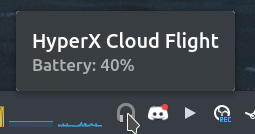
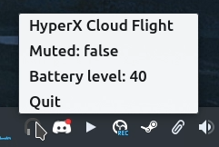

# HyperX Cloud Flight Battery Monitoring

## Introduction

Simple tray application which shows battery level for <em>[HyperX Cloud Flight Wireless Headset.](https://www.hyperxgaming.com/unitedstates/us/headsets/cloud-flight-wireless-gaming-headset)</em>

## Screenshots

<p align="center">
    
    
</p>

## Getting Started


### Prerequisites

Create new file in `/etc/udev/rules.d/99-hyperx-cloud-flight.rules` and place the following content:

```
KERNEL=="hidraw*", ATTRS{busnum}=="1", ATTRS{idVendor}=="0951", ATTRS{idProduct}=="16c4", MODE="0666"
```

Once created replug the wireless dongle.

### Installation

Download the latest binary from the releases and run it.

```console
foo@bar:~$ curl -LO https://github.com/kondinskis/hyperx-cloud-flight/releases/download/0.1.0/cloud-flight_amd64
foo@bar:~$ chmod +x cloud-flight_amd64
foo@bar:~$ ./cloud-flight_amd64
```

### Supported operating systems

- Linux 

## Help

Feel free to [report any issues](https://github.com/kondinskis/hyperx-cloud-flight/issues) you may have while using this application.

## License

This project is licensed under the MIT License - see the [LICENSE.md](https://github.com/kondinskis/hyperx-cloud-flight/blob/main/LICENSE.md) file for details

## Other Projects

* [hyperx-cloud-flight-wireless](https://github.com/srn/hyperx-cloud-flight-wireless) Module for interfacing with HyperX Cloud Flight Wireless